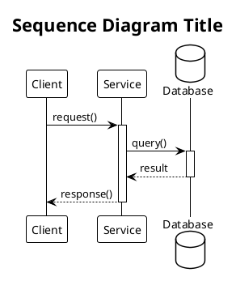

# Diagram Styles and Templates

## Draw.io (Architecture Diagrams)

### Basic mxfile Structure

```xml
<mxfile host="wiki.corp.adobe.com" agent="Claude" version="28.2.1">
  <diagram id="diagram-id" name="Diagram Name">
    <mxGraphModel dx="1400" dy="800" grid="1" gridSize="10" guides="1" tooltips="1" connect="1" arrows="1" fold="1" page="0" pageScale="1" pageWidth="850" pageHeight="1100" math="0" shadow="0">
      <root>
        <mxCell id="0" />
        <mxCell id="1" parent="0" />

        <!-- Add shapes here -->

      </root>
    </mxGraphModel>
  </diagram>
</mxfile>
```

### Shape Styles

**Rectangle (Process/Service)**
```xml
<mxCell id="box1" value="Service Name"
  style="rounded=1;whiteSpace=wrap;html=1;fillColor=#d5e8d4;strokeColor=#82b366;"
  vertex="1" parent="1">
  <mxGeometry x="100" y="100" width="120" height="60" as="geometry" />
</mxCell>
```

**Cylinder (Database/Storage)**
```xml
<mxCell id="db1" value="Database"
  style="shape=cylinder;whiteSpace=wrap;html=1;boundedLbl=1;backgroundOutline=1;fillColor=#dae8fc;strokeColor=#6c8ebf;"
  vertex="1" parent="1">
  <mxGeometry x="100" y="200" width="100" height="80" as="geometry" />
</mxCell>
```

**Diamond (Decision/Gateway)**
```xml
<mxCell id="decision1" value="Check?"
  style="shape=rhombus;whiteSpace=wrap;html=1;fillColor=#fff2cc;strokeColor=#d6b656;"
  vertex="1" parent="1">
  <mxGeometry x="100" y="300" width="100" height="80" as="geometry" />
</mxCell>
```

**Cloud (External Service)**
```xml
<mxCell id="cloud1" value="External API"
  style="ellipse;shape=cloud;whiteSpace=wrap;html=1;fillColor=#e1d5e7;strokeColor=#9673a6;"
  vertex="1" parent="1">
  <mxGeometry x="100" y="400" width="120" height="80" as="geometry" />
</mxCell>
```

**Arrow (Connection)**
```xml
<mxCell id="arrow1" value="Label"
  style="endArrow=classic;html=1;rounded=0;exitX=1;exitY=0.5;exitDx=0;exitDy=0;entryX=0;entryY=0.5;entryDx=0;entryDy=0;"
  edge="1" parent="1" source="box1" target="box2">
  <mxGeometry width="50" height="50" relative="1" as="geometry">
    <mxPoint x="300" y="300" as="sourcePoint" />
    <mxPoint x="350" y="250" as="targetPoint" />
  </mxGeometry>
</mxCell>
```

### Color Schemes

| Color Purpose | Fill Color | Stroke Color | Use Case |
|--------------|------------|--------------|----------|
| **Success/Active** | `#d5e8d4` | `#82b366` | Processes, services, active components |
| **Data/Input** | `#dae8fc` | `#6c8ebf` | Databases, storage, data flow |
| **Warning/Decision** | `#fff2cc` | `#d6b656` | Decisions, conditional logic, warnings |
| **Error/Alert** | `#f8cecc` | `#b85450` | Errors, failures, critical paths |
| **External** | `#e1d5e7` | `#9673a6` | External services, third-party APIs |
| **Neutral** | `#f5f5f5` | `#666666` | Generic components, placeholders |

### Connection Points

**Exit/Entry Points** use normalized coordinates (0 to 1):
- `exitX="0"` / `entryX="0"`: Left edge
- `exitX="0.5"` / `entryX="0.5"`: Center
- `exitX="1"` / `entryX="1"`: Right edge
- `exitY="0"` / `entryY="0"`: Top edge
- `exitY="0.5"` / `entryY="0.5"`: Middle
- `exitY="1"` / `entryY="1"`: Bottom edge

---

## PlantUML (Sequence/Flow Diagrams)

### Basic Sequence Diagram



### PlantUML Participant Types

- `participant` - Standard box
- `actor` - Stick figure (for users)
- `boundary` - Circle (for interfaces)
- `control` - Circle with arrow (for controllers)
- `entity` - Circle with line (for entities)
- `database` - Cylinder (for databases)
- `collections` - Stacked boxes (for collections)
- `queue` - Queue symbol (for message queues)

### Arrow Styles

| Arrow Syntax | Appearance | Use Case |
|-------------|------------|----------|
| `->` | Solid arrow | Synchronous call |
| `-->` | Dashed arrow | Return/response |
| `->>` | Solid arrow with filled head | Asynchronous message |
| `-->>` | Dashed arrow with filled head | Async response |
| `-\` | Arrow going down-right | Alternative path |
| `\\-` | Arrow going down-left | Alternative path |

### PlantUML Control Flow

**Parallel Execution:**
```plantuml
par Parallel Block
    service -> worker1: task1()
else
    service -> worker2: task2()
end
```

**Conditional Logic:**
```plantuml
alt Success Case
    service -> handler: success()
else Error Case
    service -> errorHandler: error()
else Fallback
    service -> defaultHandler: default()
end
```

**Loops:**
```plantuml
loop Every 5 minutes
    scheduler -> service: check()
end
```

**Optional Blocks:**
```plantuml
opt Cache Available
    service -> cache: get()
end
```

### Notes and Comments

```plantuml
note left of client
    This is a note
    on the left
end note

note right of service: Single line note

note over client, service
    Note spanning
    multiple participants
end note
```

### Activation/Deactivation

```plantuml
activate service
service -> worker: doWork()
deactivate service

' Auto-activation with ++/--
service -> worker ++: start()
worker -> db ++: query()
db --> worker --: result
worker --> service --: done
```

### Styling

```plantuml
skinparam backgroundColor white
skinparam sequenceMessageAlign center
skinparam participantPadding 20
skinparam boxPadding 10

' Participant colors
skinparam participant {
    BackgroundColor lightblue
    BorderColor blue
}
```

## Common Validation Errors

### PlantUML Syntax Errors

**❌ Multi-line arrow labels** (NOT supported):
```plantuml
service -> client: result
additional info on next line
```

**✅ Correct - inline labels**:
```plantuml
service -> client: result, additional info
```

**❌ Unclosed blocks**:
```plantuml
alt Condition
    service -> handler: handle()
' Missing 'end'
```

**✅ Correct - closed blocks**:
```plantuml
alt Condition
    service -> handler: handle()
end
```

Use `validate_plantuml.py` script to catch these errors before uploading.
